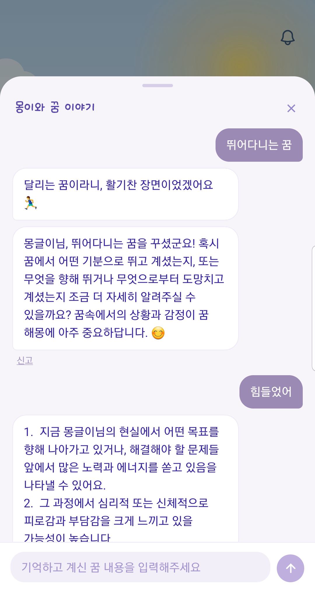
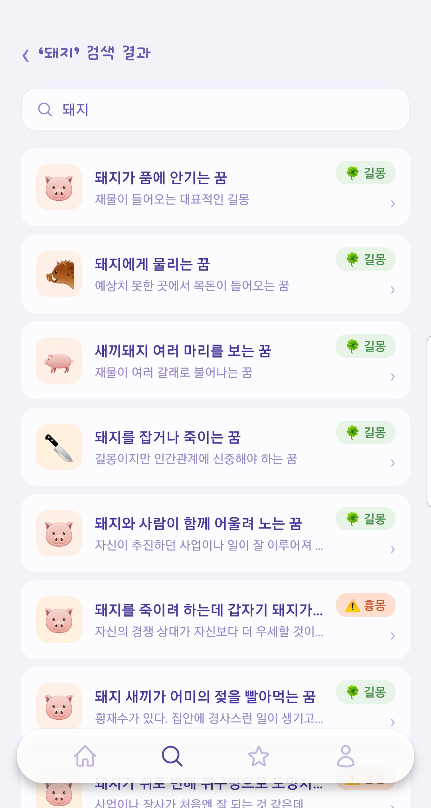
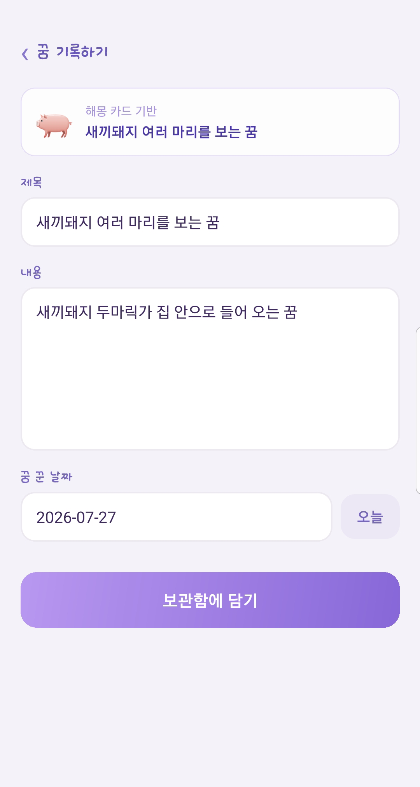
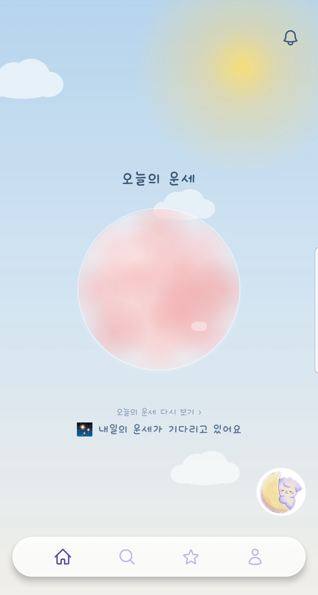
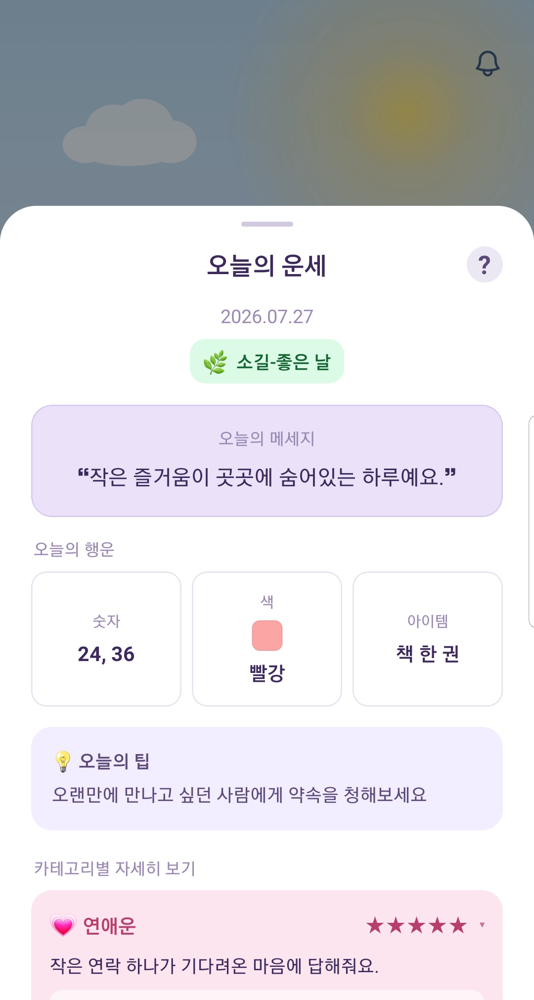
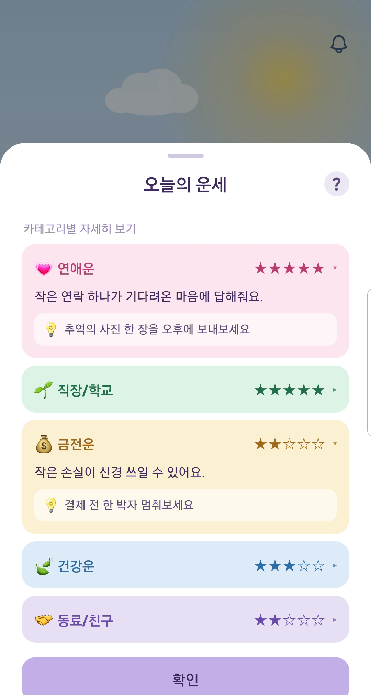

<div align="center">


# 몽글 (Mongle)

**간밤의 꿈, AI가 해몽해 드려요**

꿈을 기록하면 AI가 상징과 의미를 풀이해 주는 꿈해몽 앱입니다.
꿈 사전 검색과 나만의 꿈 일기, 하루를 여는 오늘의 운세까지 담았습니다.

[**웹에서 보기**](https://mongle-app.vercel.app) · [개인정보처리방침](https://mongle-app.vercel.app/privacy) · [이용약관](https://mongle-app.vercel.app/terms)

</div>

---

## 스크린샷

| AI 꿈해몽 챗봇 | 꿈 해몽 검색 | 꿈 기록 |
|:---:|:---:|:---:|
|  |  |  |

| 홈 (구슬) | 오늘의 운세 | 카테고리 운세 |
|:---:|:---:|:---:|
|  |  |  |

## 기능

- **AI 꿈해몽 챗봇** — 꿈 내용을 입력하면 Gemini가 상징과 의미를 스트리밍으로 풀이
- **꿈 해몽 검색** — 뱀·물·돈 등 키워드로 꿈 사전 조회
- **나만의 꿈 일기** — 꿈 기록 작성·수정·삭제, 보관함에서 AI 대화와 함께 조회
- **오늘의 운세** — 구슬을 탭하면 종합운 4등급 + 연애·직장·금전·건강·대인 5개 카테고리 + 행운 정보
- **부수 기능** — 로컬 알림(아침 운세 / 꿈 기록 리마인드), 위치 기반 날씨 연출, 프로필 편집, 공지

## 기술 스택

| 레이어 | 사용 기술 |
|---|---|
| 앱 | React Native 0.81, Expo SDK 54, Expo Router 6, TypeScript |
| 스타일 | NativeWind 4 + Tailwind CSS 4, Reanimated 4, react-native-svg |
| 상태·데이터 | TanStack Query 5, AsyncStorage |
| AI | Vercel AI SDK v6, Gemini 2.5 Flash, Zod |
| 백엔드 | Supabase (PostgreSQL, Auth, Storage, RLS) |
| 서버리스 | Vercel Edge Functions, Vercel Cron |
| 인증 | Kakao OAuth (PKCE) |
| 배포 | EAS Build, Google Play, Vercel |

하나의 코드베이스가 **Android 앱과 웹(정적 익스포트)** 양쪽으로 나갑니다.
웹 빌드는 `expo export -p web`으로 정적 HTML을 뽑아 Vercel에 올리고, 같은
저장소의 `api/*.ts`가 Edge Function으로 배포됩니다.

## 구조

```
app/                    # Expo Router 화면 (파일 기반 라우팅)
  (auth)/               #   로그인
  (app)/(tabs)/         #   홈 · 검색 · 보관함 · 마이페이지
  api 외 공개 라우트     #   /privacy /terms /about /guide /business ...
api/                    # Vercel Edge Functions (chat · weather · keepalive)
features/               # 도메인 로직 (auth · dream · fortune · chat · weather)
components/             # 공용 UI
lib/                    # supabase 클라이언트, 알림, 다이얼로그, 쿼리 클라이언트
supabase/               # 스키마 · 마이그레이션 15개 · 시드 데이터
plugins/                # Expo Config Plugin (권한 정리)
```

## 기술적으로 신경 쓴 부분

### 스트리밍과 메타데이터 추출 병렬화

챗봇은 해몽 본문을 스트리밍하면서, 동시에 보관함 카드용 메타데이터(제목·이모지·
길운지수·무드태그·해석 요약)를 `generateObject`로 뽑습니다. 메타를 `await` 하면
첫 토큰이 그만큼 늦어지므로, Promise만 잡아두고 본문 스트림이 끝난 자리에
센티널로 이어붙입니다.

```ts
const metaPromise = userMsgCount === 1
  ? extractDreamMeta(firstUserText)   // await 하지 않는다
  : Promise.resolve(null);
// ... 본문 스트리밍 ...
controller.enqueue(encoder.encode(`\n<<META>>${JSON.stringify(await metaPromise)}<</META>>`));
```

`api/chat.ts`

### 운세는 LLM 없이 시드로 생성

매일 운세를 LLM으로 만들면 사용자 수만큼 비용이 발생합니다. `사용자 ID + 날짜`를
FNV-1a로 해시해 mulberry32 PRNG를 돌리는 **결정적 알고리즘**으로 대체했습니다.
API 호출이 없고, 오프라인에서 동작하며, 같은 계정이면 기기가 바뀌어도 같은 운세가
나옵니다.

종합운·행운·카테고리는 각각 별도 시드 네임스페이스를 씁니다. 무료 영역 콘텐츠를
개편해도 다른 영역 결과가 흔들리지 않게 하기 위해서입니다.

`features/fortune/dailyFortune.ts`

### 세션이 앱 재시작마다 풀리던 문제

React Native에는 `navigator.locks`가 없어 GoTrue가 잠금 없이 동작합니다. 그러면
토큰 갱신이 동시에 두 번 나가는데, 리프레시 토큰은 1회용이라 두 번째가 실패하면서
세션이 통째로 삭제됩니다. `processLock`으로 갱신을 직렬화하고, 화면마다 흩어져
있던 `getSession()` 호출을 `useSyncExternalStore` 기반 단일 스토어로 모아
해결했습니다.

`lib/supabase.ts` · `features/auth/auth.ts`

### 카카오 OAuth를 PKCE로 직접 구현

네이티브 카카오 SDK 없이 Supabase OAuth만 사용합니다. Android의 `MainActivity`가
`singleTask`라 리다이렉트가 커스텀탭 결과 대신 딥링크 인텐트로 들어오는 경우가
있어, `openAuthSessionAsync` 결과와 `Linking` 딥링크를 양쪽 다 받아 먼저 도착하는
쪽에서 인증 코드를 잡습니다. 웹은 풀페이지 리다이렉트 + `detectSessionInUrl`로
분기합니다.

`features/auth/auth.ts`

### 스토어 출시를 위한 권한 정리

빌드된 AAB를 열어보니 라이브러리 매니페스트가 자동 병합한, 앱이 쓰지 않는 권한이
들어 있었습니다. Expo Config Plugin을 작성해 `ACCESS_FINE_LOCATION`, `CAMERA`,
`RECORD_AUDIO`, `SYSTEM_ALERT_WINDOW`, `WRITE_EXTERNAL_STORAGE`를 제거하고,
AAB 매니페스트를 직접 열어 검증했습니다.

`plugins/withTrimmedPermissions.js`

## 로컬 실행

```bash
npm install
cp .env.example .env      # 값 채우기 (아래 표 참고)
npm start                 # Metro 시작
```

`expo-notifications`, `datetimepicker` 등 네이티브 모듈을 쓰므로 Expo Go가 아닌
**development build**가 필요합니다.

```bash
npx eas build --profile development --platform android
```

### 환경 변수

| 변수 | 위치 | 용도 |
|---|---|---|
| `EXPO_PUBLIC_SUPABASE_URL` | 앱 | Supabase 프로젝트 URL |
| `EXPO_PUBLIC_SUPABASE_ANON_KEY` | 앱 | anon 키 (RLS로 보호) |
| `GOOGLE_GENERATIVE_AI_API_KEY` | 서버 | Gemini API (`api/chat.ts`) |
| `KMA_SERVICE_KEY` | 서버 | 기상청 초단기실황 (`api/weather.ts`) |
| `SUPABASE_SERVICE_ROLE_KEY` | 로컬 스크립트 | 시드 스크립트 전용 |

`EXPO_PUBLIC_` 접두사가 붙은 값만 앱 번들에 포함됩니다. 서버 전용 키에는 절대
붙이지 않습니다.

### 데이터베이스

`supabase/migrations/`의 SQL을 순서대로 적용한 뒤 `supabase/scripts/`로 꿈 사전
시드를 넣습니다.

## 배포

- **웹** — `dev` 브랜치 푸시 → Vercel 자동 빌드 (`expo export -p web` → `dist/`)
- **앱** — `npx eas build --profile production --platform android` → Play Console 업로드

버전은 EAS 원격 카운터(`appVersionSource: "remote"` + `autoIncrement`)로
관리합니다. `app.json`에 `versionCode`를 두면 충돌합니다.

## 문서

| 문서 | 내용 |
|---|---|
| [PROGRESS.md](PROGRESS.md) | 진행 상황, 완료 작업, 남은 할 일, 릴리스 빌드 이력 |
| [STORE_LISTING.md](STORE_LISTING.md) | Play 스토어 등록 자료, 데이터 안전 양식, 콘텐츠 등급 답변 |
| [FORTUNE_CATEGORIES.md](FORTUNE_CATEGORIES.md) | 운세 카테고리 설계 |

## 라이선스

개인 프로젝트입니다. 코드·디자인·콘텐츠의 무단 사용을 금합니다.
